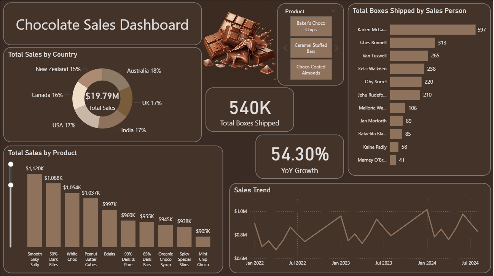

# **Global Chocolate Sales & Growth Analysis**

### **Objective**
Designed a data-driven dashboard to monitor international sales performance, tracking a $19.79M revenue portfolio. The project focuses on identifying seasonal trends, salesperson efficiency, and market expansion across 6 key global regions.

### **Technical Implementation (Power BI Skills)**
* **Growth Modeling:** Developed DAX measures to calculate a **54.30% Year-over-Year (YoY)** growth rate.
* **Geographical Insights:** Analyzed market distribution across **Australia, USA, India, UK, Canada, and New Zealand**.
* **Salesforce Evaluation:** Created ranking systems to track individual salesperson performance and shipping volume (**540K total boxes**).

### **Key Insights**
* **Financial Success:** Achieved a total revenue of **$19.79M**, with a highly balanced global market share (Australia leading at 18%).
* **Top Product Performance:** **"Smooth Silky Salty"** is the primary revenue driver, exceeding **$1.12M** in sales.
* **Seasonality Trends:** Identified consistent sales peaks in **January and July**, aligning with major holiday gifting seasons.
* **Team Excellence:** **Karlen McCaffrey** emerged as the top performer, successfully managing the shipment of **597 boxes**.

---
### **Dashboard Preview**

